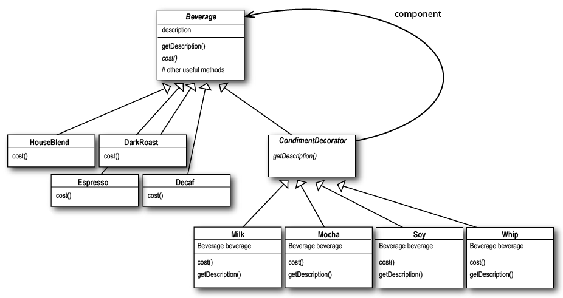

# Decorator Pattern

This pattern attach addition responsabilities to an object dinamically. Decorators provide a flexible alternative to subclassing for extending functionality.

When using subclassing, different subclasses extend a class in different ways. But an extension is bound to the class at compile-time and can't be changed at run-time.

This pattern encourages Open/Close principle: classes should be open for extension but close for modification
 

