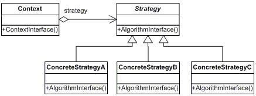

# Strategy Pattern

This pattern belongs to behavior patterns and encapsulate an algorithm inside a class.

This patterns has:
 - Context: a concrete class that can have differents behaviors. Has a reference to an interface that holds the behaviour, the client of this concrete class can define and change the behavior at run time. Instead of use inheritance here we're using composition (see bellow).
  - Strategy: the abstraction (interface or abstract class) that define the operations of the behavior that will change.
  - ConcreteStrategy: the concrete implementations that holds the different behaviors that the client can use.
  

#### The inheritance problem

So yes, we can define different behaviors subclassing a class, but the inheritance has a problem and it's that the real problen we're modeling can change in the time and the super class can be obsolete. For example, we can have a super class that models animals that have a method called `run`, but ey! what if we want a subclass that model a duck. The ducks doesn't runs, the ducks fly!.

To avoid this problem, a common strategy is:
*Favors composition over inheritance*

Inheritance define an `IS A` relationship.
Composition define an `HAS A` relationship.

It's more flexible to have an abstraction inside a class that give us some behaviour and we can change that behaviour at run time. That having a behaviour define in a class that we must override.
